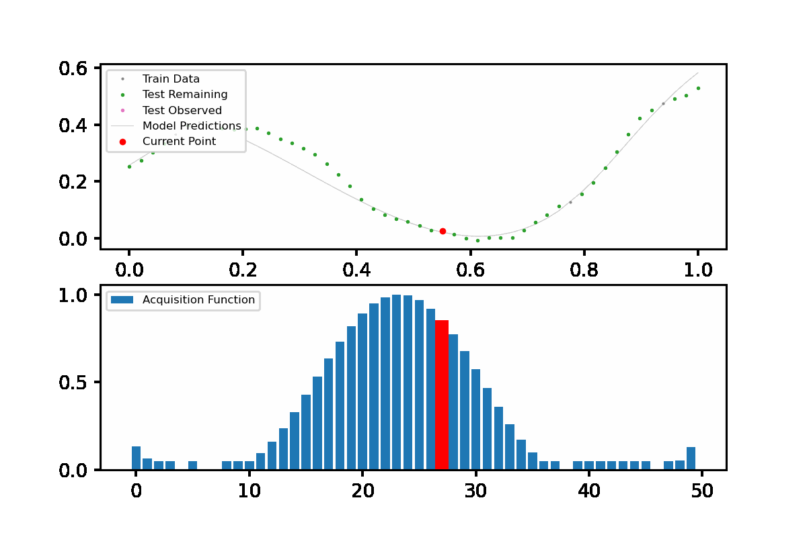

# Active Testing: Sample-Efficient Model Evaluation

Hi, good to see you here! 👋

This is code for "Active Testing: Sample-Efficient Model Evaluation".

Please cite our paper, if you find this helpful:

```
@article{kossen2021active,
  title={{A}ctive {T}esting: {S}ample-{E}fficient {M}odel {E}valuation},
  author={Kossen, Jannik and Farquhar, Sebastian and Gal, Yarin and Rainforth, Tom},
  journal={arXiv:2103.05331},
  year={2021}
}
```



## Setup

The `requirements.txt` can be used to set up a python environment for this codebase.
You can do this, for example, with `conda`:

```
conda create -n isactive python=3.8
conda activate isactive
pip install -r requirements.txt
```

## Reproducing the Experiments

* To reproduce a figure of the paper, first run the appropriate experiments
```
sh reproduce/experiments/figure-X.sh
```
* And then create the plots with the Jupyter Notebook at
```
notebooks/plots_paper.ipynb
```
* (The notebook let's you conveniently select which plots to recreate.)

* Which should put plots into `notebooks/plots/`.

* In the above, replace `X` by 
    * `123` for Figures 1, 2, 3
    * `4` for Figure 4
    * `5` for Figure 5
    * `6` for Figure 6
    * `7` for Figure 7

* Other notes
    * Synthetic data experiments do not require GPUs and should run on pretty much all recent hardware.
    * All other plots, realistically speaking, require GPUs.
    * We are also happy to share a 4 GB file with results from all experiments presented in the paper.
    * You may want to produce plots 7 and 8 for other experiment setups than the one in the paper, i.e. ones you already have computed.
    * Some experiments, e.g. those for Figures 4 or 6, may run a really long time on a single GPU. It may be good to
        * execute the scripts in the sh-files in parallel on multiple GPUs.
        * start multiple runs in parallel and then combine experiments. (See below).
        * end the runs early /  decrease number of total runs (this can be very reasonable -- look at the config files in `conf/paper` to modify this property)
    * If you want to understand the code, below we give a good strategy for approaching it. (Also start with synthetic data experiments. They have less complex code!)


## Running A Custom Experiment

* `main.py` is the main entry point into this code-base.
    * It executes a a total of  `n_runs` active testing experiments for a fixed setup.
    * Each experiment:
        * Trains (or loads) one main model.
        * This model can then be evaluated with a variety of acquisition strategies.
        * Risk estimates are then computed for points/weights from all acquisition strategies for all risk estimators.

* This repository uses `Hydra` to manage configs.
    * Look at `conf/config.yaml` or one of the experiments in `conf/...` for default configs and hyperparameters.
    * Experiments are autologged and results saved to `./output/`.

* See `notebooks/eplore_experiment.ipynb` for some example code on how to evaluate custom experiments.
    * The evaluations use `activetesting.visualize.Visualiser` which implements visualisation methods.
    * Give it a `path` to an experiment in `output/path/to/experiment` and explore the methods.
    * If you want to combine data from multiple runs, give it a list of paths.
    * I prefer to load this in Jupyter Notebooks, but hey, everybody's different.

* A guide to the code
    * `main.py` runs repeated experiments and orchestrates the whole shebang.
        * It iterates through all `n_runs` and `acquisition strategies`.
    * `experiment.py` handles a single experiment.
        * It combines the `model`, `dataset`, `acquisition strategy`, and `risk estimators`.
    * `datasets.py`, `aquisition.py`, `loss.py`, `risk_estimators.py` all contain exactly what you would expect!
    * `hoover.py` is a logging module.
    * `models/` contains all models, scikit-learn and pyTorch.
        * In `sk2torch.py` we have some code that wraps torch models in a way that lets them be used as scikit-learn models from the outside.

## And Finally

Thanks for stopping by!

If you find anything wrong with the code, please contact us.

We are happy to answer any questions related to the code and project.